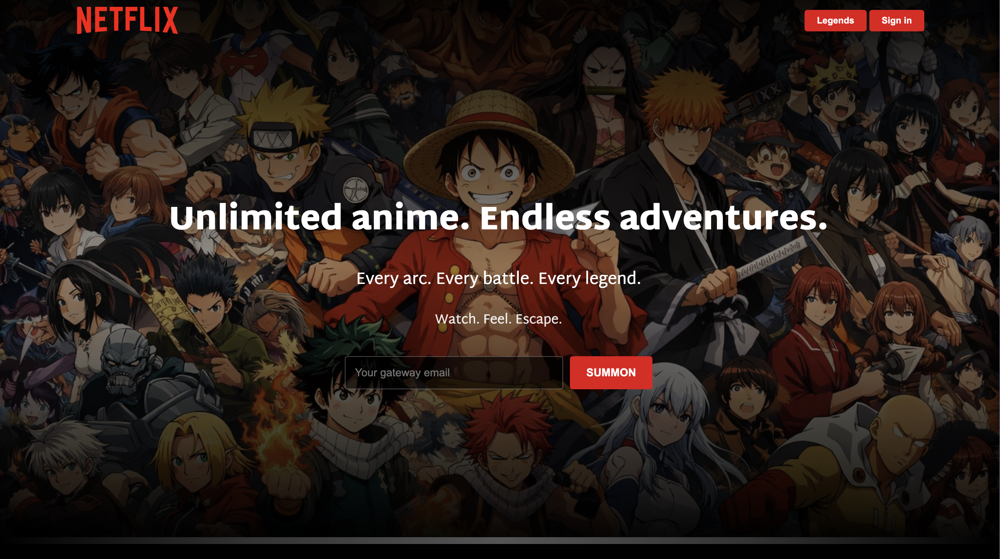

# AnimeFlix 🎬

A **Netflix-style anime landing page** built using HTML and CSS.

This project is a front-end replica of a streaming UI inspired by Netflix, redesigned for anime content.  
You can see the live demo here:  
🔗 **https://gokulsaibanala.github.io/animeflix/**

> ⚠️ *This is a UI clone built for learning and portfolio purposes only. It is not affiliated with or endorsed by Netflix.*

---

## 🚀 Live Demo

Check it out here:  
👉 https://gokulsaibanala.github.io/animeflix/

---

## 📌 Features

- ✔️ Hero banner with gradient overlay  
- ✔️ Responsive layout  
- ✔️ Movie/anime card rows with smooth hover effects  
- ✔️ Sticky navbar with custom logo  
- ✔️ Dark theme UI inspired by modern streaming platforms

---

## 🛠️ Tech Stack

This project was built using:

- HTML  
- CSS  
- GitHub Pages (for deployment)

No JavaScript or backend logic — purely UI and layout.

---

## 📸 Screenshots

*(Add these after adding them to your repo’s `screenshots/` folder)*

  


---

## 🧠 What I Learned

- Responsive design principles  
- Flexbox and layout techniques  
- Using gradients and overlays effectively  
- Deploying static sites on GitHub Pages

---

## 📁 File Structure

```text
animeflix/
├─ index.html
├─ style.css
├─ bg.jpeg
├─ animeflix-logo.svg
└─ (any other images)
